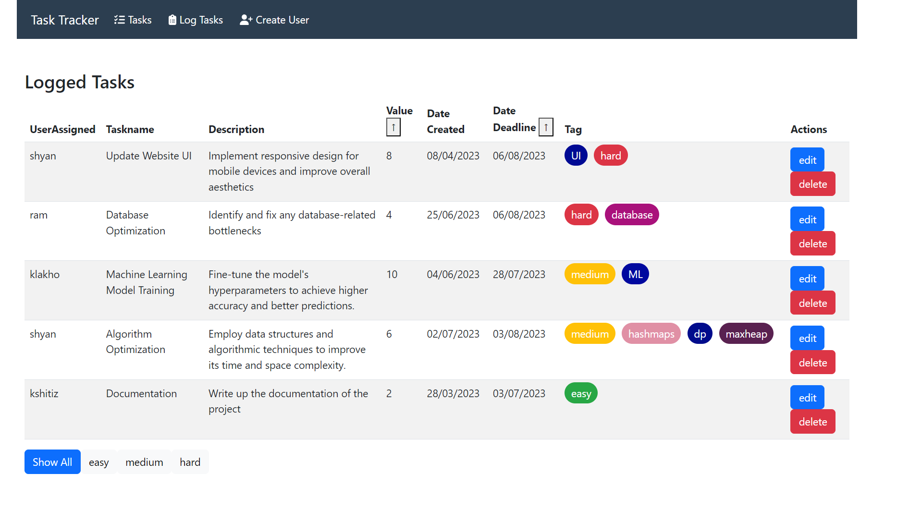

# Task-Track - MERN Stack Task Management Application

The Task Track App is a sophisticated task management application built on the MERN stack (MongoDB, Express, React, Node.js). It allows users to track their tasks, assign them to specific users, add color-coded tags for easy categorization, filter tasks by tags, sort tasks by deadline or value, and perform editing and deletion operations.

## Features

- **User and Task Schema**: The app follows a structured schema with separate models for users and tasks, allowing users to manage their tasks efficiently.

- **Color-Coded Tags**: Users can add color-coded tags to tasks, making it easy to categorize and distinguish tasks based on different criteria.

- **Filter by Tags**: Users can filter tasks based on specific tags, enabling them to focus on specific task categories.

- **Sort by Deadline**: Tasks can be sorted based on their deadlines, ensuring users prioritize tasks with approaching due dates.

- **Sort by Value**: Users can also sort tasks based on their assigned value, helping them focus on tasks with higher priority or importance.
